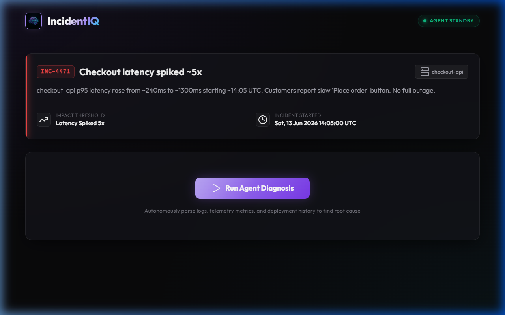
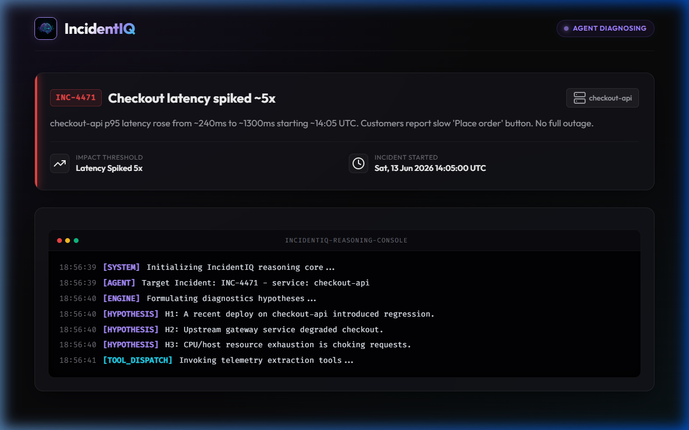
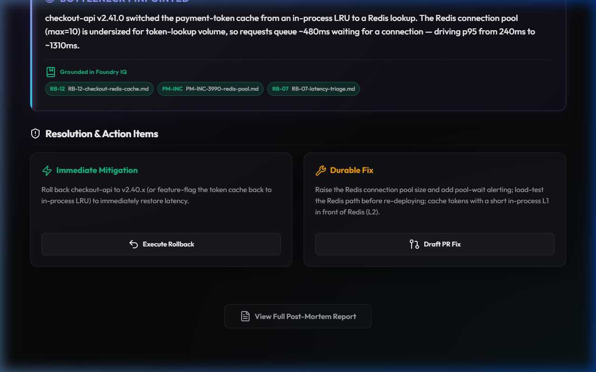
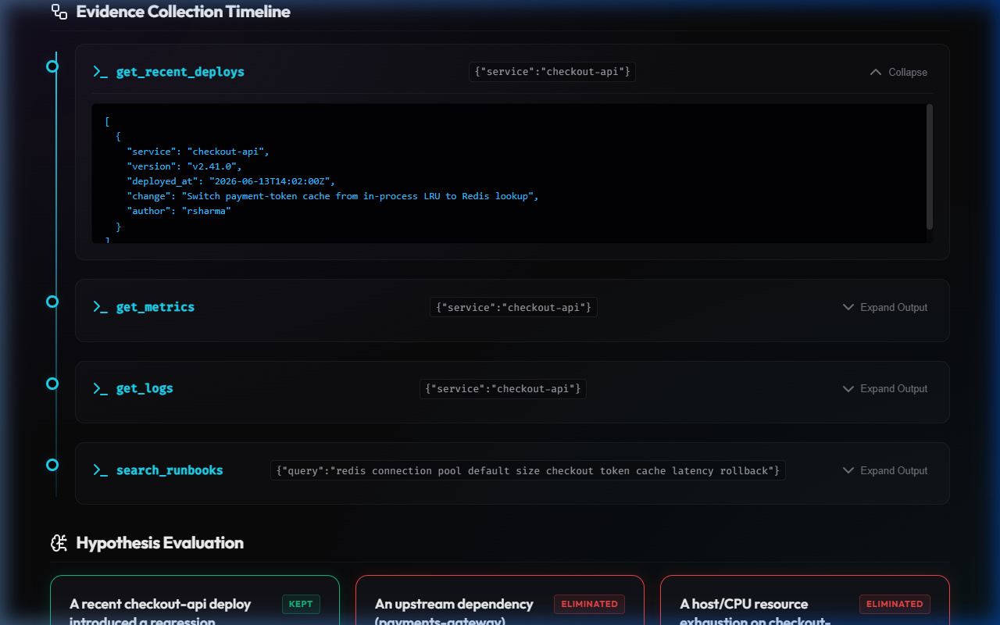
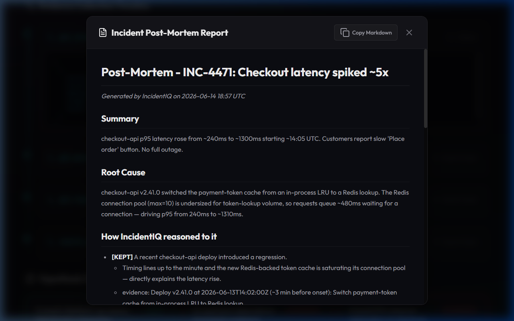

# IncidentIQ — Root-Cause Reasoning Agent for Production Incidents

**Agents League Hackathon (Microsoft Innovation Studio) · Track: Reasoning Agents · Foundry IQ**

When a production system breaks — say checkout latency spikes 5x — on-call
engineers burn hours under pressure manually correlating logs, metrics, and
recent deploys. IncidentIQ is an autonomous reasoning agent that does that
correlation in seconds: given an incident alert it pulls the telemetry, forms
hypotheses, **tests and eliminates each one through multi-step reasoning**, ranks
the surviving root causes with evidence, and drafts a post-mortem plus a
suggested fix.

The point of the project is the *visible reasoning*: hypothesis → tool call →
eliminate → conclude.

## Quick start

```bash
# Local reasoning mode — runs fully offline, no Azure needed
python -m incidentiq.main

# Also write the post-mortem
python -m incidentiq.main --postmortem out.md

# Microsoft Foundry mode (needs Azure creds; see .env.example)
python -m incidentiq.main --foundry
```

Run from the `src/` directory, or `pip install -e .` first.

## Run the web app

```bash
# Install web dependencies (once)
pip install -r requirements.txt

# From the project root
uvicorn incidentiq.api:app --reload --app-dir src
```

Open **http://localhost:8000/docs** for the interactive API explorer.

| Endpoint | What it does |
|----------|-------------|
| `GET /api/incident` | Returns the demo incident (INC-4471) |
| `POST /api/diagnose` | Runs the reasoning loop, returns full `ReasoningTrace` as JSON |
| `GET /api/postmortem` | Runs the reasoning loop, returns post-mortem Markdown |

The frontend UI lives in `frontend/` and is served at `/`.
Set `AZURE_SEARCH_*` vars in `.env` (see `.env.example`) to enable live Foundry IQ retrieval.

## What a run looks like

```
■ INCIDENT INC-4471: Checkout latency spiked ~5x
  → tool get_recent_deploys(...) ✓
  → tool get_metrics(...) ✓
  → tool get_logs(...) ✓

  Hypotheses:
   [✓ KEPT]        A recent checkout-api deploy introduced a regression.
   [✗ ELIMINATED]  An upstream dependency (payments-gateway) degraded.
   [✗ ELIMINATED]  Host/CPU resource exhaustion on checkout-api.

  ROOT CAUSE: checkout-api v2.41.0 moved the payment-token cache to Redis;
  the pool (max=10) is undersized, so requests queue ~480ms ...
```

## Web Dashboard Walkthrough

IncidentIQ features a gorgeous, dark-themed glassmorphism web dashboard to visualize the agent's multi-step reasoning process in real-time. Below is a walkthrough of the diagnostic flow:

### 1. Agent Standby
When an incident is ingested (e.g., checkout latency spike), the dashboard loads the metadata from the telemetry system. The agent is in standby state, waiting for authorization to start the root-cause reasoning loop.



### 2. Autonomous Diagnosis In-Progress
Clicking **Run Agent Diagnosis** kicks off the reasoning loop. A simulated SRE terminal console opens, displaying live telemetry extraction tool calls (`get_recent_deploys`, `get_metrics`, `get_logs`), hypothesis formulation, and evidence collection.



### 3. Step-by-Step Reasoned Conclusion
Once the diagnosis completes, the dashboard sequentially reveals the gathered facts:
* **Evidence Collection Timeline**: Interactive list of all tools executed by the agent.
* **Hypothesis Evaluation**: Visual cards indicating which hypotheses were kept or eliminated with accompanying evidence.
* **Identified Root Cause**: The pinpointed bottleneck, grounded directly in Foundry IQ (Azure AI Search) runbooks.
* **Resolution & Action Items**: Interactive buttons for automated mitigation (rollback) and long-term fix (creating a PR).



### 4. Grounded Tool Telemetry
In the timeline, you can expand any tool call to inspect the raw JSON telemetry metrics, logs, or deployment details that the reasoning agent extracted.



### 5. AI-Generated Post-Mortem Report
Clicking **View Full Post-Mortem Report** opens a glassmorphism modal with a detailed markdown post-mortem (incident summary, root cause analysis, timeline, and actions) ready to be copied into your incident management tool.



## How it works

Two execution paths share one reasoning loop and produce the same
`ReasoningTrace`:

1. **Foundry mode** (`agent.run_foundry`) — a Microsoft Foundry / Azure AI agent
   with the tools in `tools.TOOL_SPECS` registered, orchestrated via the Agent
   Framework, backed by **Foundry IQ** (Azure AI Search) for cited knowledge retrieval.
2. **Local reasoning mode** (`agent.run_local`) — a deterministic, transparent
   stand-in that runs the identical hypothesis → tool-call → eliminate → conclude
   loop offline. Also uses **Foundry IQ** retrieval when Azure creds are present,
   so the demo always runs and the grounding story is always visible.

Tools (`get_recent_deploys`, `get_metrics`, `get_logs`) are backed by mock
telemetry here and by **Azure MCP** servers (GitHub Deployments, Azure Monitor,
Log Analytics) in production.

### Knowledge grounding (Foundry IQ)

Every diagnosis is grounded in a knowledge base of runbooks and past post-mortems
(`knowledge/`) via the `search_runbooks` tool, so each conclusion carries a **citation**
(e.g. `[RB-12]`) instead of a hallucinated claim. When `AZURE_SEARCH_ENDPOINT` /
`AZURE_SEARCH_INDEX` / `AZURE_SEARCH_KEY` are set, `search_runbooks` performs real
**Foundry IQ agentic retrieval** via Azure AI Search — this is the required Microsoft IQ
layer. Without those env vars it falls back to a keyword scan over the local `knowledge/`
files so the demo always runs offline. See [`.env.example`](.env.example) for the vars.

See [`docs/architecture.svg`](docs/architecture.svg) for the diagram.

## Layout

```
src/incidentiq/
  agent.py       reasoning loop (Foundry + local modes), ReasoningTrace
  tools.py       agent tools + JSON schemas registered with Foundry
  mock_data.py   demo telemetry (stands in for Azure MCP)
  postmortem.py  ReasoningTrace -> Markdown post-mortem
  main.py        CLI entry point
scenarios/        incident scenarios
docs/             architecture
```

## Submission checklist

- [x] Innovation Studio profile activated + registered
- [x] Project created on Innovation Studio (Reasoning Agents track)
- [x] Working project — runnable reasoning loop with tools, live at `agents-league-microsoft.vercel.app`
- [x] **Foundry IQ integration live** — Azure AI Search (`incidentiq-srch`, East US) with 3 runbooks indexed; cited grounding confirmed in production
- [x] Public GitHub repo — `github.com/theAdityaNVS/incidentiq-agents-league` (no secrets)
- [x] Architecture diagram — `docs/architecture.svg`
- [ ] Demo video ≤2 min (script in `VIDEO_SCRIPT.md`) — record, upload to YouTube/Vimeo, add link
- [ ] Submit on Innovation Studio

## Tech

Microsoft Foundry (Foundry IQ) · Azure MCP · Agent Framework · GitHub Copilot · Python
